# Manual de instalación para Plugin Prestashop

## Descripción

Este plugin oficial ha sido creado para que puedas integrar Onepay fácilmente en tu comercio, basado en Prestashop.

## Requisitos

Debes tener instalado previamente Prestashop.

## Instalación de Plugin

1. Dirígete a [https://github.com/TransbankDevelopers/transbank-plugin-prestashop-onepay/releases](https://github.com/TransbankDevelopers/transbank-plugin-prestashop-onepay/releases), y descargue la última versión disponible del plugin.

  Una vez descargado el plugin, ingresa a la página de administración de Prestashop (usualmente en _misitio.com_/admin), y dirígete a Módulos, Módulos y Servicios, indicado a continuación:

  
  
2. Haz click sobre el botón "Subir un módulo":

  
  
3. Se abrirá un cuadro para subir el módulo descargado previamente. Procede a arrastrar el archivo, o haz click en "selecciona el archivo" y selecciónalo desde tu computador:

  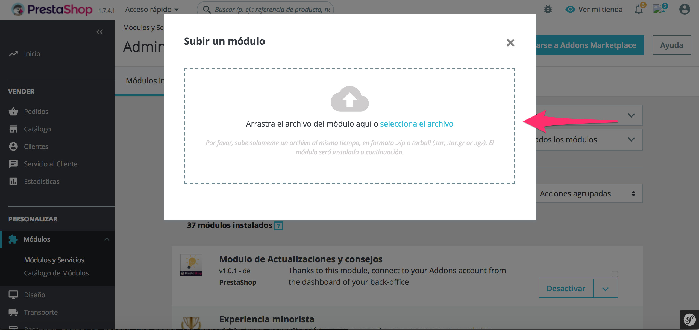

4. Prestashop procederá a instalar el módulo. Una vez finalizado, se te indicará que el módulo fue instalado, y cuando esto suceda debes hacer click en el botón "Configurar":

  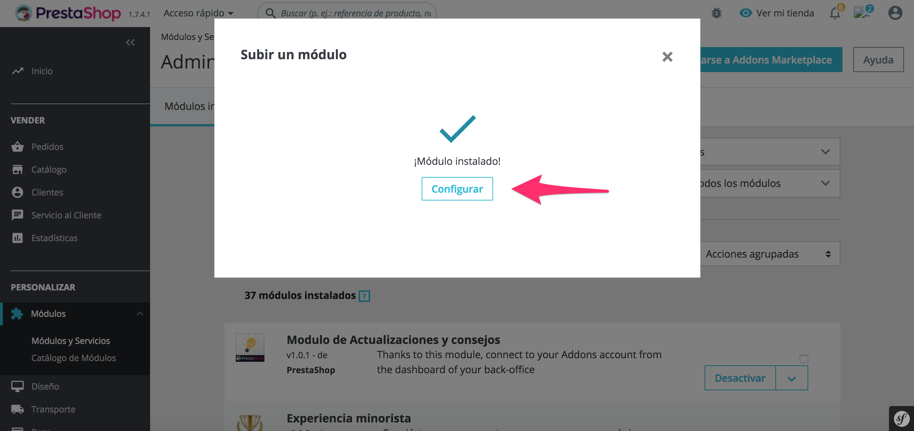

5.- Serás redirigido al listado de módulos disponibles. Busca "Onepay", y presiona el botón "Configurar":

  

## Configuración

Este plugin posee un sitio de configuración que te permitirá ingresar credenciales que Transbank te otorgará, y además podrás generar un documento de diagnóstico en caso que Transbank te lo pida.

Para acceder a la configuración, debes seguir los siguientes pasos:

1. Dirígete a la página de administración de Prestashop (usualmente en _misitio.com_/admin), y luego anda a Módulos, Módulos y Servicios.

  

2. Busca "Onepay", y presiona el botón "Configurar":

  
  
3. ¡Ya está! Estás en la pantalla de configuración del plugin, debes ingresar la siguiente información:
  * **Activar Onepay**: Al activarlo, Onepay estará disponible como medio de pago. Ten la precaución de que se encuentre marcada esta opción cuando quieras que los usuarios paguen con Onepay.
  * **APIKey**: Es lo que te identifica como comercio.
  * **Shared Secret**: Llave secreta que te autoriza y valida a hacer transacciones.
  * **Endpoint**: Ambiente hacia donde se realiza la transacción. 

  Las opciones disponibles para _Endpoint_ son: "Integración" para realizar pruebas y certificar la instalación con Transbank, y "Producción" para hacer transacciones reales una vez que Transbank ha aprobado el comercio.

  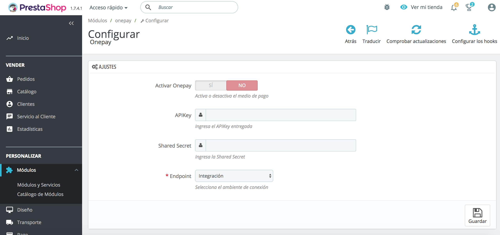
  
4. Además, puedes generar un documento de diagnóstico en caso que Transbank te lo pida. Para ello, haz click en "Generar PDF de Diagnóstico", y automáticamente se descargará dicho documento.

  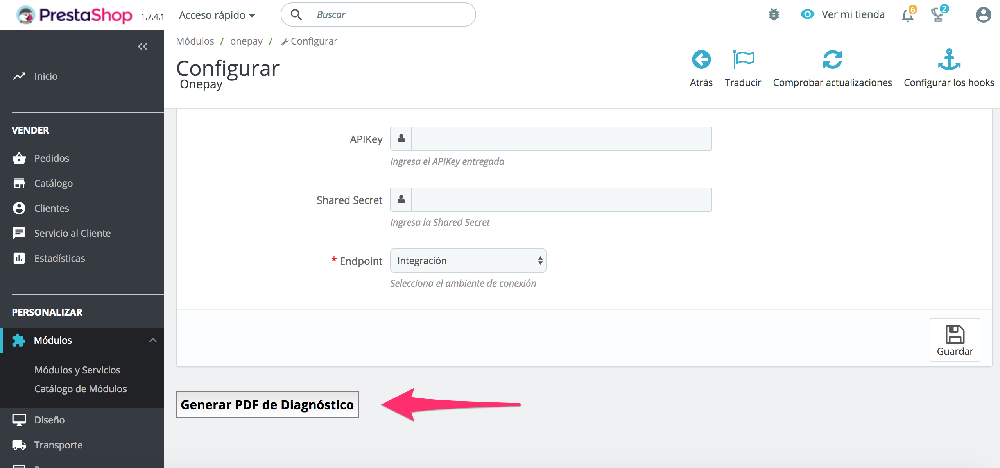

## Credenciales de Prueba

Para el ambiente de Integración, puedes utilizar las siguientes credenciales para realizar pruebas:

* APIKey: `dKVhq1WGt_XapIYirTXNyUKoWTDFfxaEV63-O5jcsdw`
* Shared Secret: `?XW#WOLG##FBAGEAYSNQ5APD#JF@$AYZ`

## Prueba de instalación con transacción

En ambiente de integración es posible realizar una pruebas de transacción utilizando un emulador de pagos online.

* Para ello, agrega al carro de compras un producto:
  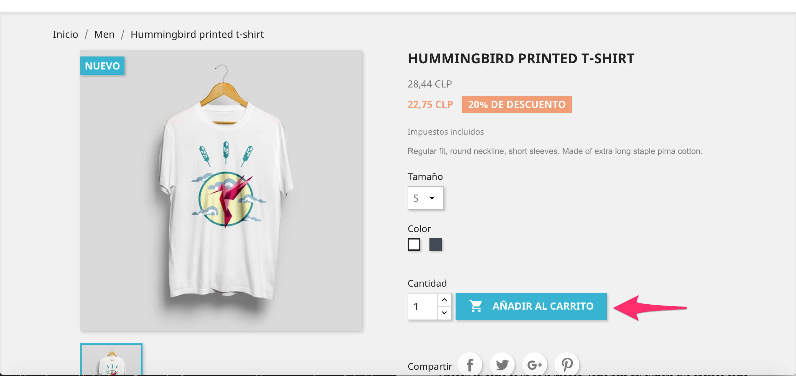

* Luego anda al checkout para iniciar el flujo de pago, haciendo click en "Pasar por caja":
  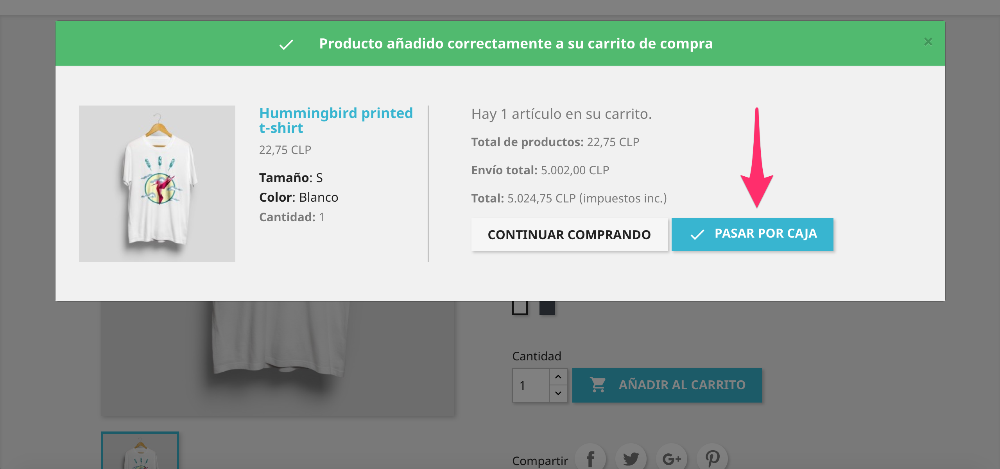
  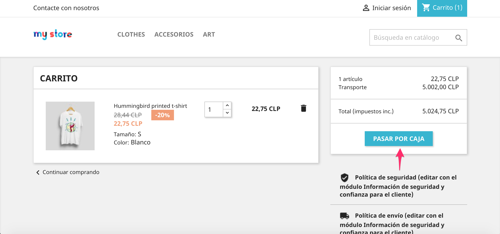
  
* En la página de checkout, ingresa los datos requeridos para realizar la compra:
  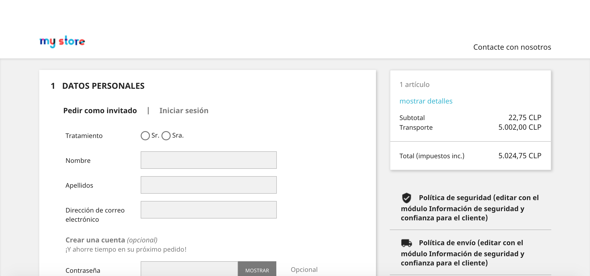

* Selecciona la opción "Pagar con Onepay", y presiona el botón "Pedido con obligación de pago".
  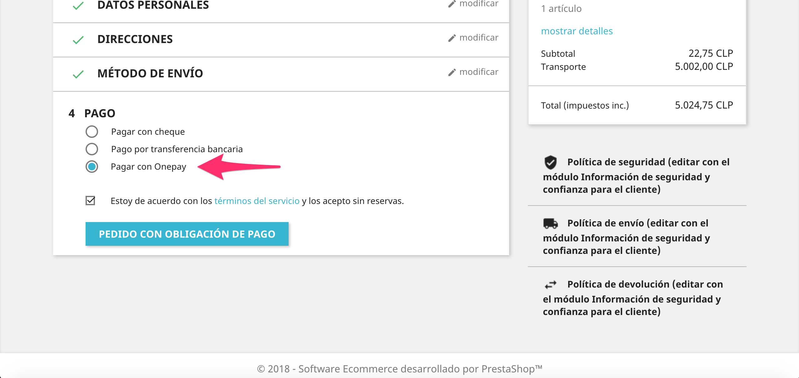

* Una vez presionado el botón para iniciar la compra, se mostrará la ventana de pago Onepay, tal como se ve en la imagen. Toma nota del número que aparece como "Código de compra", ya que lo necesitarás para emular el pago en el siguiente paso:
  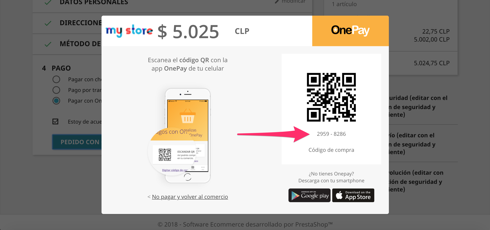
  
* En otra ventana del navegador, ingresa al emulador de pagos desde [https://onepay.ionix.cl/mobile-payment-emulator/](https://onepay.ionix.cl/mobile-payment-emulator/), utiliza test@onepay.cl como correo electrónico, y el código de compra obtenido desde la pantalla anterior. Una vez ingresado los datos solicitados, presiona el botón "Iniciar Pago":
  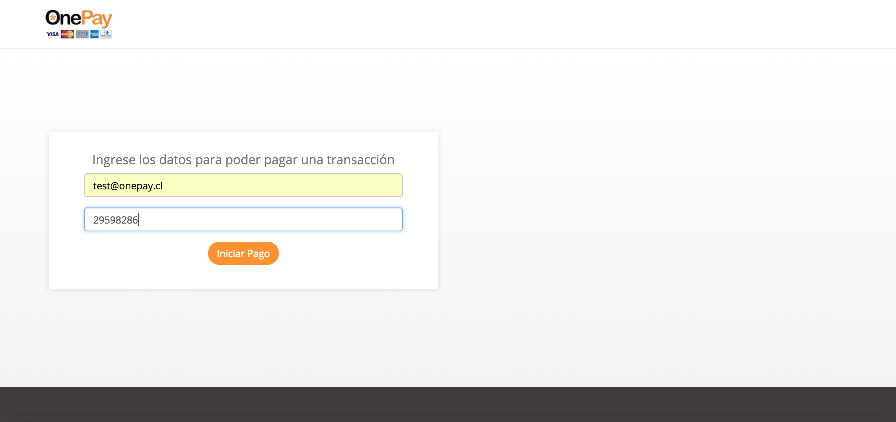
  
* Si todo va bien, el emulador mostrará opciones para simular situaciones distintas. Para simular un pago exitoso, presiona el botón `PRE_AUTHORIZED`. En caso de querer simular un pago fallido, presiona le botón `REJECTED`. Simularemos un pago exitóso presionando el botón `PRE_AUTHORIZED`.
  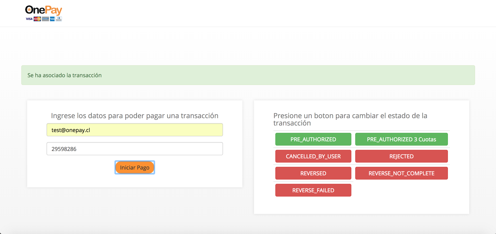
  
* Vuelve a la ventana del navegador donde se encuentra Prestashop, y podrás comprobar que el pago ha sido exitoso.
 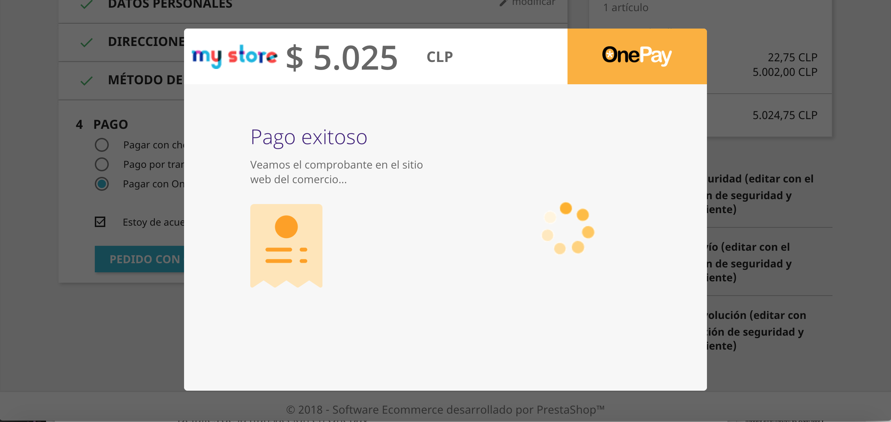

* Automáticamente serás redirigido a Prestashop, con la comprobación final del pago.
 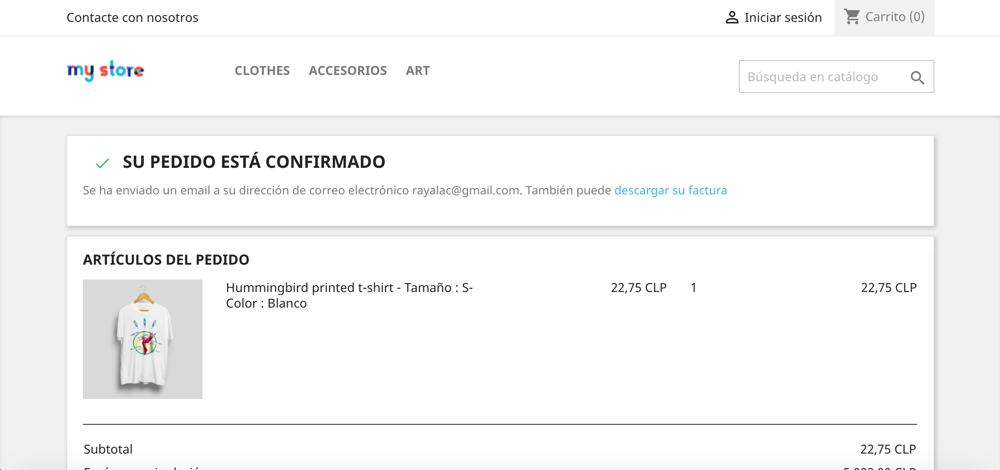
